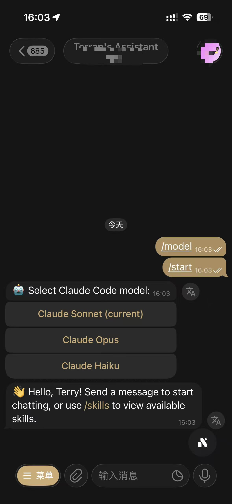
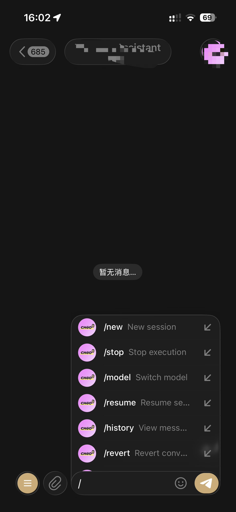
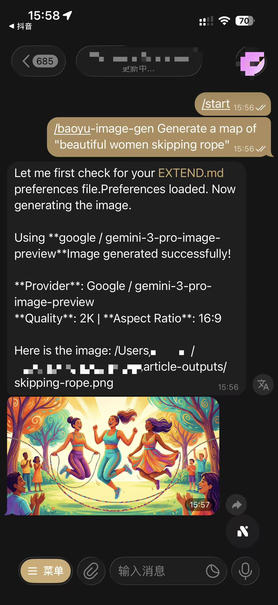

# Claude Telegram Bot Bridge

[中文文档](README-zh.md)

Turn your Telegram into a remote Claude Code terminal. Chat with Claude, run skills, edit code, search files — all from your phone, anywhere.

## The Problem

Claude Code is powerful, but it's bound to your terminal. When you step away from your computer — commuting, in a meeting, or just on the couch — you lose access. You can't quickly check a build result, ask Claude to fix a bug, or run a skill command until you're back at your desk.

Solutions like [OpenClaw](https://github.com/anthropics/openclaw) exist, but they come with trade-offs: a full web stack to deploy and maintain, potential security concerns with exposing your dev environment through a web interface, and heavyweight infrastructure that feels like overkill when you just want to quickly send Claude a message from your phone.

This bot takes a different approach — **lightweight, zero-infrastructure, secure by default**. It connects Claude Code SDK to a Telegram bot (a messaging app you already have), so you get a persistent, always-on Claude Code session you can talk to from anywhere. No web server, no ports to expose, no extra auth layer. Start it once for a project directory, and it runs as a daemon in the background — surviving crashes, rebooting with your Mac, managing its own dependencies. Telegram itself handles authentication, encryption, and push notifications.

## Features

### Screenshots

| | | |
|:---:|:---:|:---:|
|  |  |  |

**Core**
- Chat with Claude directly in Telegram, powered by Claude Code SDK
- Invoke any Claude Code skill (`/skill <name>`) or slash command (`/command <cmd>`) remotely
- Switch between Sonnet, Opus, and Haiku on the fly via `/model`
- Resume previous conversations with `/resume` and browse session history
- View recent conversation history with `/history` — displays last 5 messages from current session
- Revert to any previous message with `/revert` — choose from 5 modes: full restore (code + conversation), conversation only, code only, summarize from point, or cancel

**Smart Interaction**
- Progressive streaming: AI responses update in real-time as Claude thinks, not after completion
- Claude's numbered options auto-convert to Telegram inline keyboard buttons — just tap to choose
- File paths in Claude's responses are automatically sent as photos or documents — covers document, spreadsheet, presentation, data, archive, and audio/video/image types (source-code files are not auto-sent, to avoid pushing every edited file during coding). Files up to 50 MB; those under `PROJECT_ROOT` send automatically, and files outside it ask for a one-tap confirmation before sending instead of being dropped
- Inbound Telegram documents are downloaded into a private project-scoped temporary path and passed to the active agent runtime for inspection
- Native Telegram voice messages: auto-download, format detection/conversion (OGG/AMR → MP3), Whisper transcription, then forwarded to Claude
- Per-user dedicated SDK streams — low latency, concurrent message support (up to 3 per user)
- Priority `/stop` command: immediately cancels running tasks and voice transcription, even when message queue is full
- Priority `/revert` command: bypasses message queue limit, cancels active operations, restores conversation state to any previous point

**Security**
- File access inside the project directory is auto-allowed
- Access outside the project triggers inline-button confirmation in Telegram
- User whitelist via `ALLOWED_USER_IDS`
- Stale messages (>20 min) are silently dropped

**Operations**
- Daemon mode with auto-restart on crash (stops after 5 rapid crashes in 60s)
- One-command macOS launchd auto-start on boot (`--install`) with inherited `PATH`/`HOME`
- Auto-update check on startup — notifies when new version available
- One-command upgrade (`--upgrade`) — pulls latest code and reinstalls dependencies
- MD5-based dependency caching — skips reinstall when `requirements.txt` is unchanged
- Auto venv creation, 14-day log rotation, crash logging with exit codes
- Dedicated polling HTTP client with proxy-aware HTTP/1.1 settings for better recovery after network changes

## Prerequisites

- **Python 3.11+**
- **Provider CLI** — Claude CLI (default), or Codex CLI when `CCC_AGENT_PROVIDER=codex`
- **Codex authentication** — for Codex, complete the CLI login flow and pass `../scripts/ccc-doctor.sh` before starting the bridge
- **Telegram Bot Token** — from [@BotFather](https://t.me/BotFather)
- **ffmpeg** — required for audio format conversion
- **OpenAI API Key** — required for Whisper transcription (`OPENAI_API_KEY`)

## Platform Support

- **macOS** — fully supported, including launchd auto-start via `--install` / `--uninstall`
- **Linux (systemd)** — supported, including reboot-persistent auto-start via `--install-systemd` / `--uninstall-systemd`
- **WSL (Ubuntu/Debian-style Linux userland)** — supported for foreground run, `--daemon`, `--status`, and `--stop`
- **Native Windows (PowerShell / CMD)** — not supported

## Quick Start

```bash
git clone https://github.com/jinwon-int/ccc-node
cd ccc-node/bridge
./setup.sh
```

Start the bot after setup:

```bash
./start.sh --path /path/to/your/project
```

The installed runtime identity comes from the canonical ccc-node checkout, not
from the historical bridge changelog or upstream releases. Use
`./start.sh --version` to read it and `./start.sh --upgrade` to invoke the
reviewed `scripts/ccc-self-update.sh` path. See
[Version and provenance](../docs/version-and-provenance.md).

### Common Commands

```bash
./start.sh --path /path/to/project              # Start (foreground)
./start.sh --path /path/to/project -d           # Start (daemon/background)
./start.sh --path /path/to/project --debug      # Debug mode
./start.sh --path /path/to/project --status     # Check status
./start.sh --path /path/to/project --stop       # Stop
./start.sh --path /path/to/project --upgrade    # Update to latest version
./start.sh --path /path/to/project --install    # macOS only: install startup service
./start.sh --path /path/to/project --uninstall  # macOS only: remove startup service
./start.sh --path /path/to/project --install-systemd    # Linux: install systemd startup service (reboot-persistent)
./start.sh --path /path/to/project --uninstall-systemd  # Linux: remove systemd startup service
```

> **Linux reboot-persistence.** `--install` is macOS/launchd only. On Linux use `--install-systemd`:
> run as root it writes a system unit to `/etc/systemd/system/ccc-telegram-bridge.service` and
> runs `systemctl enable --now`; run as a normal user it installs a `systemctl --user` unit under
> `~/.config/systemd/user`. systemd supervises the bridge in the foreground (restart-on-failure),
> so do not combine it with `-d`. Override the unit name with `BRIDGE_SERVICE_NAME=...` to run
> multiple bridges on one host.

## Usage Examples

### Fix a bug from your phone

You're away from your desk and a teammate reports a bug. Open Telegram:

```
You:   login page crashes when email contains a plus sign
Claude: I found the issue in src/auth/validator.ts:42 — the regex
        doesn't escape the + character. Fixed and the test passes now.
```

### Run a skill remotely

```
You:   /skill commit
Claude: Created commit: fix(auth): escape special characters in email validation
```

### Send a voice message

```
You:   [send Telegram voice message]
Bot:   🎤 Voice: summarize yesterday's git diff
Claude: Here is a summary of yesterday's changes...
```

### Resume yesterday's work

```
You:   /resume
Bot:   1. Refactoring auth module — 2 hours ago
       2. Adding dark mode — yesterday
       3. API rate limiting — 3 days ago
You:   1
Claude: Resuming session... [continues from where you left off]
```

### Check recent conversation history

```
You:   /history
Bot:   📜 Recent History (last 5 messages)

       🧑 User [2026-03-05 14:23:15]
       fix the login bug

       🤖 Assistant [2026-03-05 14:23:18]
       I found the issue in src/auth/validator.ts:42...

       🧑 User [2026-03-05 14:25:30]
       add a test for this

       🤖 Assistant [2026-03-05 14:25:35]
       Added test in tests/auth.test.ts...
```

### Revert to a previous conversation state

```
You:   /revert
Bot:   🔄 Select a message to revert to:
       [Shows paginated list of last 50 messages with inline buttons]

You:   [Tap on a message]
Bot:   Choose revert mode:
       1️⃣ Restore code and conversation
       2️⃣ Restore conversation only
       3️⃣ Restore code only
       4️⃣ Summarize from here
       5️⃣ Cancel

You:   [Tap "Restore code and conversation"]
Bot:   ✅ Reverted to message #42. Conversation and code state restored.
```

You:   1
Bot:   Switched to session: Refactoring auth module

You:   where did we leave off?
Claude: We finished extracting the JWT logic into a separate service.
        Still remaining: updating the middleware to use the new service...
```

### Switch models mid-conversation

```
You:   /model haiku
Bot:   Switched to Claude Haiku

You:   summarize the changes in src/api/ from the last 3 commits
Claude: ...
```

### Set Codex reasoning effort

When `CCC_AGENT_PROVIDER=codex`, `/effort` shows only the effort values
advertised for the selected model by Codex `model/list`. The override is stored
per Telegram conversation and is sent on each `turn/start`.

```
You:   /effort
Bot:   Select reasoning effort for GPT-5.3-Codex...

You:   /effort high
Bot:   Reasoning effort set to high

You:   /effort default
Bot:   Reasoning effort reset to model default
```

Changing `/model` preserves the current effort only when the new model advertises
it as supported; otherwise the override is removed and the bot reports the reset.
`/effort` is unavailable while the Claude provider is active.

### Let the bot run 24/7

```bash
# Install as macOS startup service — survives reboots
./start.sh --path ~/my-project --install

# The generated launchd plist preserves PATH and HOME
# so Claude CLI and proxy settings still resolve at boot

# Check status anytime
./start.sh --path ~/my-project --status
# 🟢 Bot is running (PID: 12345)

# Uninstall when done
./start.sh --path ~/my-project --uninstall
```

## Bot Commands

| Command | Description |
|---|---|
| `/start` | Start a conversation |
| `/new` | Start a new session (clears current stream and cancels ongoing streaming) |
| `/model` | Switch model (provider-specific list or `/model <id>`) |
| `/usage` | View read-only provider rate limits and current-session usage without starting a turn |
| `/effort [value\|default]` | Select or reset per-conversation Codex reasoning effort |
| `/resume` | Browse and resume a previous session (shows progress summary with last assistant message) |
| `/stop` | Interrupt execution immediately (bypasses queue, cancels active task) |
| `/history` | View recent conversation history |
| `/revert` | Revert to a previous conversation state (browse history, select message, choose restore mode) |
| `/skills` | List available Claude Code skills |
| `/skill <name> [args]` | Execute a skill command |
| `/command <cmd> [args]` | Execute a Claude Code slash command |

Any unrecognized `/command` is also forwarded as a skill invocation.

`/usage` uses Codex app-server read methods and already-observed token updates.
For Claude it uses only existing Agent SDK result metadata plus an optional,
sanitized status-line snapshot. Codex output omits the
`GPT-5.3-Codex-Spark` bucket and account lifetime/daily history, suppresses
empty context/session-token rows, and renders reset timestamps in KST. Claude
continues to report missing data as `unavailable`. The command never launches
a provider turn or reads transcript/credential files.

## Environment Variables

| Variable | Required | Default | Description |
|---|---|---|---|
| `TELEGRAM_BOT_TOKEN` | Yes | — | Telegram Bot API token |
| `ALLOWED_USER_IDS` | No | *(allow all)* | Comma-separated user ID whitelist; `owner-operator` requires exactly one owner |
| `CCC_REQUIRE_ALLOWLIST` | No | `true` | Refuse startup when the allowlist is empty; must stay true for `owner-operator` |
| `CCC_BRIDGE_EXECUTION_PROFILE` | No | `strict-project` | Execution boundary: `strict-project`, `owner-operator`, or `disabled` |
| `CCC_BRIDGE_BASH_POLICY` | No | `auto-approve` | Bash approval UX; Codex default is unrestricted `never + dangerFullAccess` |
| `CCC_AGENT_PROVIDER` | No | `claude` | Agent provider: `claude` or `codex` |
| `CCC_CODEX_CLI_PATH` | Codex only | `~/.claude/hooks/ccc-codex` | Installed memory-bootstrap launcher used for direct/app-server runs |
| `CCC_CODEX_REAL_CLI_PATH` | Codex only | `codex` | Underlying Codex binary invoked by the launcher |
| `CCC_CODEX_MEMORY_MATERIALIZER_PATH` | Codex only | `~/.claude/hooks/ccc_codex_memory.py` | Body-free materialize/status command run at thread boundaries |
| `CCC_CODEX_MEMORY_BOOTSTRAP_TIMEOUT_SEC` | Codex only | `14` | Per-command materializer timeout |
| `CLAUDE_CLI_PATH` | No | *(auto-detect)* | Absolute path to Claude CLI binary |
| `CLAUDE_SETTINGS_PATH` | No | `~/.claude/settings.json` | Path to Claude Code settings file |
| `CLAUDE_PROCESS_TIMEOUT` | No | `600` | SDK timeout in seconds |
| `CCC_MAX_DOCUMENT_SIZE_MB` | No | `10` | Maximum inbound Telegram document size in decimal MB (1–20) |
| `AUTO_NEW_SESSION_AFTER_HOURS` | No | `24` | Auto-start new session after N hours of inactivity; set to `0`/`false`/`off` to disable |
| `DRAFT_UPDATE_MIN_CHARS` | No | `150` | Minimum characters before streaming draft update |
| `DRAFT_UPDATE_INTERVAL` | No | `1.0` | Minimum seconds between streaming draft updates |
| `ENABLE_STREAMING_TOOL_CALLS` | No | `false` | Show Claude tool calls in Telegram streaming messages |
| `TRANSCRIPTION_PROVIDER` | No | `whisper` | Voice transcription provider: `whisper` or `volcengine` |
| `OPENAI_API_KEY` | Voice only | — | OpenAI API key for Whisper transcription |
| `OPENAI_BASE_URL` | No | *(official OpenAI API)* | OpenAI-compatible Whisper endpoint base URL |
| `WHISPER_MODEL` | No | `whisper-1` | Whisper model name |
| `VOLCENGINE_APP_ID` | Volcengine only | — | Volcengine ASR `X-Api-App-Key` |
| `VOLCENGINE_TOKEN` | Volcengine only | — | Volcengine ASR `X-Api-Access-Key` |
| `VOLCENGINE_ACCESS_KEY` | Volcengine only | — | Volcengine TOS Access Key |
| `VOLCENGINE_SECRET_ACCESS_KEY` | Volcengine only | — | Volcengine TOS Secret Access Key (create at `https://console.volcengine.com/iam/keymanage`) |
| `VOLCENGINE_TOS_BUCKET_NAME` | Volcengine only | — | TOS bucket used for staging Telegram voice files |
| `VOLCENGINE_TOS_ENDPOINT` | Volcengine only | — | TOS endpoint (must match your bucket region, e.g. `https://tos-cn-shanghai.volces.com`) |
| `VOLCENGINE_TOS_REGION` | No | `cn-beijing` | TOS region used by SDK signing |
| `FFMPEG_PATH` | No | *(auto-detect)* | Absolute path to ffmpeg binary |
| `VOICE_REPLY_PERSONA` | No | `Tingting` | Persona name used by voice reply mode |
| `LOG_LEVEL` | No | `INFO` | Logging level |
| `PROXY_URL` | No | — | HTTP proxy; auto-configures `http_proxy`/`https_proxy`/`all_proxy` |

## Inbound Document Handling

- Non-image Telegram documents are accepted after the normal allowlist and declared-size checks.
- All file types are accepted, including executable binaries: the sender allowlist is the trust boundary. Uploads are stored non-executable (`0600`) and are never run by the bridge; agent-side execution stays gated by the Bash tool policy.
- Telegram's returned file metadata is rechecked before storage. Each upload is created relative to a validated owner-owned `0700` directory fd, with a random server-side name, `O_EXCL`/`O_NOFOLLOW`, and validated regular-file `0600` permissions.
- Actual writes are bounded by `CCC_MAX_DOCUMENT_SIZE_MB` (default: 10 decimal MB, range: 1–20).
- The local path, sanitized display name, MIME type, size, and optional caption are passed to the active agent runtime. Unsupported runtime formats are reported explicitly.
- Temporary files are removed after success, failure, or cancellation; startup pruning touches only regular bridge-generated artifacts and does not follow symlinks.

## Voice Transcription Channels

- Default channel is `whisper`.
- To use Volcengine file-fast ASR, set:
  - `TRANSCRIPTION_PROVIDER=volcengine`
  - `VOLCENGINE_APP_ID`
  - `VOLCENGINE_TOKEN`
  - `VOLCENGINE_ACCESS_KEY`
  - `VOLCENGINE_SECRET_ACCESS_KEY`
  - `VOLCENGINE_TOS_BUCKET_NAME`
  - `VOLCENGINE_TOS_ENDPOINT`
- Secret Access Key must be created in Volcengine IAM key management:
  - `https://console.volcengine.com/iam/keymanage`
- In Volcengine mode, the bot now uses `download -> TOS upload -> signed TOS URL -> ASR`.

## Voice Reply Mode (macOS)

- User voice messages switch reply mode to voice automatically.
- User text messages switch reply mode back to text.
- In voice mode:
  - `>1000` Chinese characters or `>1000` English words: text only (voice mode is kept)
  - `>300` characters (and not over 1000 threshold): send voice + text
  - Otherwise: send voice only
- Voice transcription preview (`🎤 Voice: ...`) is bundled with the final reply:
  - if text is sent, preview is merged at the top of that same text message
  - if voice-only reply is sent, the bot sends preview text first, then voice
- The bot uses macOS `say` for synthesis, then converts output to Telegram-compatible `ogg/opus` via `ffmpeg`.
- `VOICE_REPLY_PERSONA` should be a real macOS voice name from `say -v ?`.
- If `VOICE_REPLY_PERSONA` is unavailable on current system, the bot sends a friendly error and falls back to text for that reply.
- Set `VOICE_REPLY_PERSONA` to the first-column name shown by `say -v ?`.
- Example:
  - `VOICE_REPLY_PERSONA=Tingting`

## ffmpeg Installation

Install ffmpeg before enabling voice messages:

- macOS (Homebrew): `brew install ffmpeg`
- Ubuntu/Debian or WSL: `sudo apt-get update && sudo apt-get install -y ffmpeg`

Then verify:

```bash
ffmpeg -version
```

## Whisper Cost Notes

Voice transcription uses OpenAI Whisper API (`whisper-1`) and incurs usage-based charges.
Current reference pricing is about **$0.006/minute** of audio. Check OpenAI pricing for latest values.

## Security

- `--path` sets the `PROJECT_ROOT` working directory and structured-tool approval boundary.
- Structured file tools (`Read`, `Edit`, `Write`, `MultiEdit`, `Glob`, `Grep`) keep their existing UX policy: paths inside `PROJECT_ROOT` are auto-allowed and outside paths require user confirmation.
- `CCC_BRIDGE_EXECUTION_PROFILE` selects the execution boundary independently from Bash approval:
  - `strict-project` (package default) preserves the fail-closed Claude Code OS sandbox: host reads are denied by default, only `PROJECT_ROOT` plus the minimal runtime is re-allowed, unsandboxed fallback/excluded commands are disabled, and user/project/local settings are suppressed. Linux/WSL2 requires `bubblewrap` and `socat`; unsupported/unavailable sandbox backends fail closed.
  - `owner-operator` deliberately runs without the OS sandbox and restores normal user/project/local settings plus host-capable Claude Code utility. It starts only with `CCC_REQUIRE_ALLOWLIST=true` and exactly one `ALLOWED_USER_IDS` owner. This profile trusts that owner boundary and is **not** a prompt-injection defense.
  - `disabled` hard-denies Bash and suppresses user/project/local filesystem settings so settings hooks cannot retain host execution. Unknown or unsafe profile values also resolve to disabled.
- `CCC_BRIDGE_BASH_POLICY` controls approval UX: `auto-approve` (default), `auto-review`, `approve-each`, or `disabled`. Claude approval never widens its selected execution profile. **Codex is different:** its default `auto-approve` policy intentionally requests full access regardless of `strict-project` vs `owner-operator`. Claude treats `auto-review` conservatively like `approve-each` because Claude has no Codex reviewer. Codex maps `approve-each` to app-server `approvalPolicy=untrusted`: trusted commands such as `ls`, `cat`, and `sed` run without a prompt, while untrusted actions use the owner-only Telegram approval UI.
- Codex `auto-approve` (the package default) sends `approvalPolicy=never`, no reviewer, and `sandboxPolicy={type: dangerFullAccess}` on every turn. It provides unrestricted external/Tailscale network, host filesystem, systemd, SSH, device, and out-of-workspace access without an approval prompt. When the bridge runs as root, every allowlisted Telegram user is part of the root trust boundary; prefer exactly one trusted owner. This mode is not sandboxed and is not a prompt-injection defense.
- Codex `auto-review` sends `approvalPolicy=on-request`, `approvalsReviewer=auto_review`, and `sandboxPolicy={type: workspaceWrite, networkAccess: false}` on every turn. Routine workspace work proceeds without a prompt; eligible filesystem or network boundary crossings are evaluated by Codex's reviewer agent. Auto-review does not widen the sandbox, automatically grant network access, or provide a security guarantee. Reviewer denials instruct the main agent to find a materially safer path or stop and ask the user.
- Codex provider approvals that still reach Telegram are delivered only to the single allowlisted owner. They are turn-scoped and offer Allow or Deny only; Codex has no session-wide **Allow All** path. The owner may tap a button or send an exact standalone reply such as `승인`, `허용`, `진행`, `approve`, `allow`, `거절`, `취소`, or `deny`. Ordinary sentences and ambiguous multiple-pending cases never allow. `auto-approve` maps to Codex `never`; disabled policy requests are denied without rendering approval buttons. Because Codex `untrusted` is not a deny-all mode, trusted read commands can still run when the Bash policy is `disabled`; do not treat the Codex approval UX as a command-disable control.
- Bot output referencing external files requires confirmation before sending.
- All runtime data stays under `PROJECT_ROOT/.telegram_bot/`.

### Codex readiness and rollout

Codex rollout is source/config driven and must be serial:

1. Install Codex CLI, authenticate it using the CLI's normal login flow, and run repository `setup.sh` so `ccc-codex` plus `ccc_codex_memory.py` are installed under the harness hooks directory.
2. Set `CCC_AGENT_PROVIDER=codex`. Keep `CCC_CODEX_CLI_PATH` on the installed `ccc-codex` wrapper and set `CCC_CODEX_REAL_CLI_PATH` only when the real binary is not found as `codex`. The package-default `auto-approve` policy is `never + dangerFullAccess`; use an explicit non-default Bash policy if unrestricted host/network access is not intended.
3. Run `../scripts/ccc-memory-check.sh --json` and require `.codex.status == "ready"`, then run `../scripts/ccc-doctor.sh` and require `readiness: ready`. These diagnostics are body-free and do not start a model turn or poll Telegram.
4. Stop the existing bridge owner, then start exactly one replacement and verify status. **Two services must never poll the same Telegram bot token concurrently.**

Roll back by stopping the Codex bridge, restoring `CCC_AGENT_PROVIDER=claude`, and starting the prior Claude bridge as the sole poller. Do not overlap old and new services during rollout or rollback.

## Lifecycle Management

```bash
./start.sh --path /path/to/project --status       # Check if running
./start.sh --path /path/to/project --stop         # Stop
./start.sh --path /path/to/project --install      # macOS only: launchd auto-start on boot
./start.sh --path /path/to/project --uninstall    # macOS only: remove auto-start
```

The daemon auto-restarts on crash, logs each crash with exit code and uptime, and stops restarting after 5 rapid crashes in 60 seconds.

When `PROXY_URL` is set, both regular Bot API calls and long-polling requests use proxy-aware HTTP/1.1 clients. This helps the bot recover more reliably after laptop sleep, network handoffs, or proxy reconnects.

### macOS Full Disk Access

If your project directory is located in `~/Documents`, `~/Desktop`, or `~/Downloads`, macOS privacy protection will block launchd from reading files in those directories. This causes `--install` to fail with exit code 78 (EX_CONFIG).

**Solution**: Add `/bin/bash` to Full Disk Access:

1. Open **System Settings** → **Privacy & Security** → **Full Disk Access**
2. Click the **+** button
3. Press `Cmd + Shift + G` and type `/bin/bash`
4. Select `bash` and confirm

After this, `--install` will work correctly in protected directories.

## Debugging

```bash
./start.sh --path /path/to/project --debug
# Or: BOT_DEBUG=1 python -m telegram_bot --path .
```

Enables full console logging, per-session chat logs, and SDK tool call tracing.

## License

MIT

## Star History

[](https://star-history.com/#jinwon-int/ccc-node&Date)
